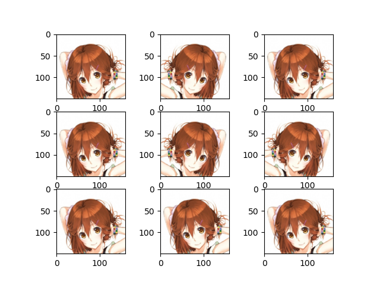
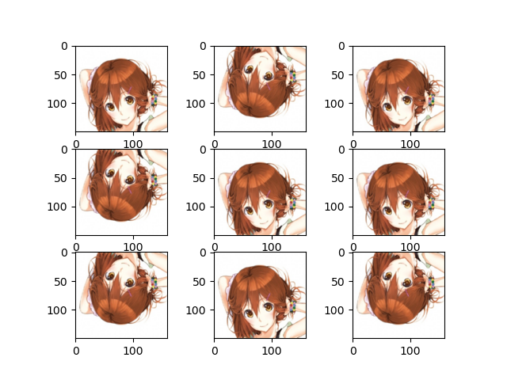
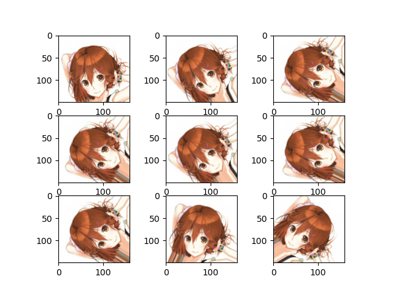
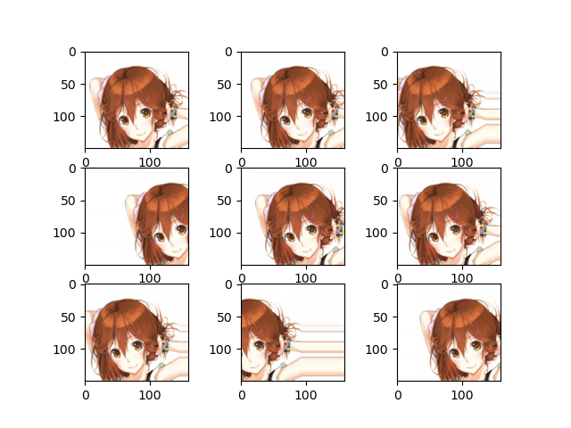
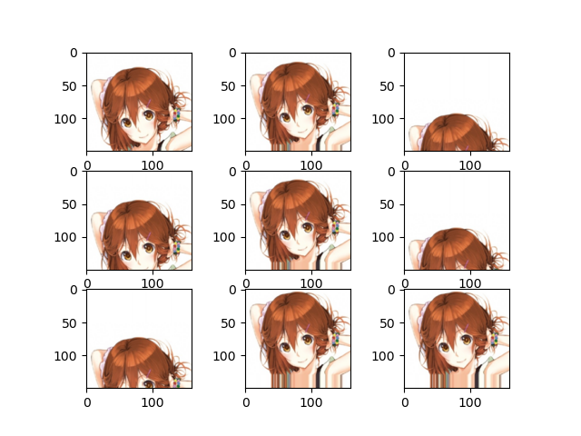
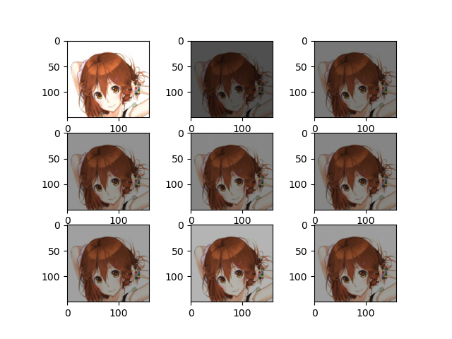
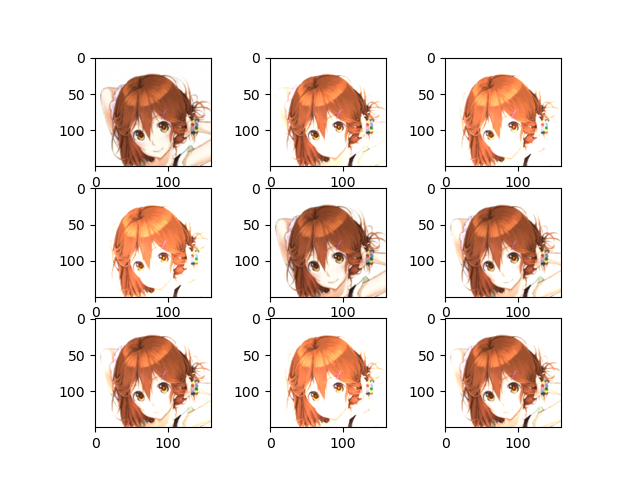
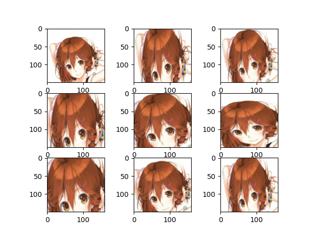
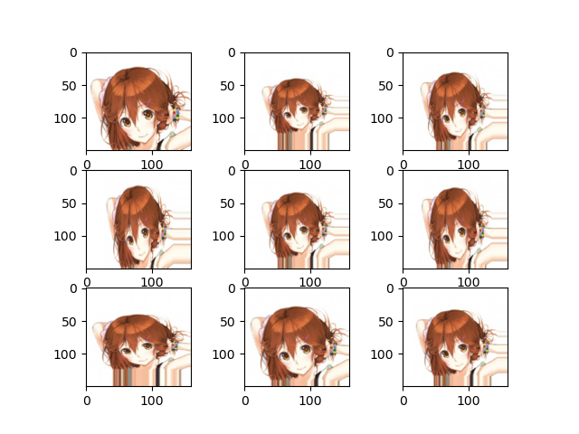
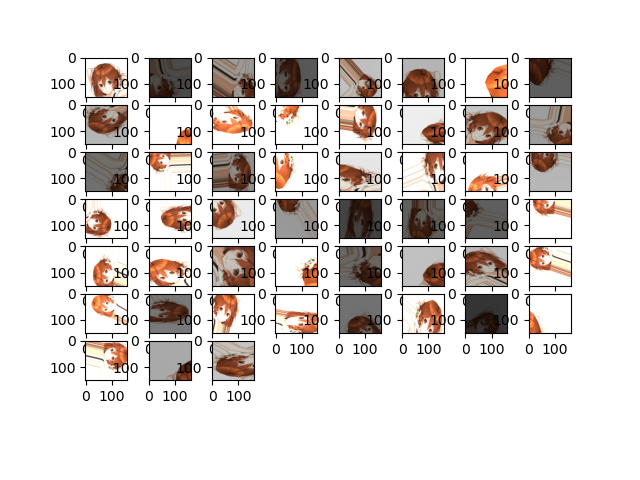

Assignment_2: 04/05/2021

# ASSIGNMENT 2: IMAGE AUGMENTATION

# Nhiệm vụ

1. Tìm hiểu về image augmentation
2. Các hàm để augment trong python (opencv, keras, pytorch, augmentor, albumentations, ...) chạy thử và show lại kết quả vào Readme
3. Code 1 chương trình augment 1 tập data tùy chọn

# Nộp

Thời gian: 23h59 thứ 4 ngày 12/05/2021

1. Code
2. Folder data ban đầu và sau khi augment
3. Readme về các hàm augment

# ASSIGNMENT 2: IMAGE AUGMENTATION

Trịnh Phương Đông

## I. Data Augmentation

- Đôi khi việc tìm kiếm dữ liệu khó khăn, ta chỉ có một tập dữ liệu giới hạn cho trước, vậy làm thế nào để train model hiệu quả, ta có thể dùng Data Augmentation.
- Data Augmentation hay còn gọi là tăng cường dữ liệu khi tập dữ liệu còn ít cho việc training. Việc này sẽ tạo ra dữ liệu mới phục vụ cho việc training dựa vào dữ liệu cho trước.

## II. Một số kỹ thuật Augmentation phổ biến với ảnh

### 1.1 Sử dụng Class `ImageDataGenerator` của Keras

> Chỉ sử dụng một hình ảnh làm mẫu, có thể thay đổi code để load toàn bộ data

1. **Flip** (Lật ảnh)

- **Lật ảnh ngang**

`ImageDataGenerator(horizontal_flip=True)`

- **Lật ảnh dọc**

`ImageDataGenerator(vertical_flip=True)`

2. **Rotation** (Xoay ảnh)

- **Xoay ảnh ngẫu nhiên một góc trong khoảng 0 đến 90 độ**

`ImageDataGenerator(rotation_range=90)`

3. **Shift** (Chuyển vị trí)

- **Dịch ảnh ngang một khoảng ngẫu nhiên từ 0 đến 80 đơn vị**

`ImageDataGenerator(width_shift_range=80)`

- **Dịch ảnh dọc một khoảng ngẫu nhiên từ 0 đến 80 đơn vị**

`ImageDataGenerator(height_shift_range=80)`

4. **Brightness** (Tăng giảm độ sáng)

- **Giảm độ sáng**

`ImageDataGenerator(brightness_range=[0.2,1.0])`

- **Tăng độ sáng**

`ImageDataGenerator(brightness_range=[1.0,1.8])`

5. **Zoom** (Phóng to hoặc thu nhỏ)

- **Zoom in**

`ImageDataGenerator(ImageDataGenerator(zoom_range=[0.5, 1.0]))`

- **Zoom out**

`ImageDataGenerator(ImageDataGenerator(zoom_range=[1.0, 1.5]))`

### 1.2 Chạy thử chương trình

Chạy thử với đầu vào là 1 ảnh và đầu ra là 50 ảnh, sử dụng tất cả các phương thức trên một cách ngẫu nhiên.

> **ImageDataGenerator**(
> _horizontal_flip=True,
> vertical_flip=True,
> rotation_range=90,
> width_shift_range=80,
> height_shift_range=80,
> brightness_range=[0.2, 1.8],
> zoom_range=[0.5, 1.5]
> )_

### 2.1 Sử dụng thư viện Albumentation

(Đang tìm hiểu)
